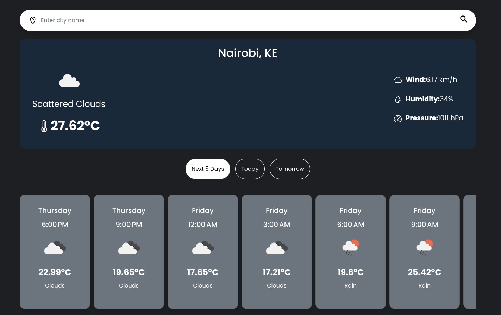

# Weather App with CI/CD Pipeline

## Overview
This project is a Weather Application built using C# and following a Clean Architecture approach. The app fetches current weather and forecast data using the [OpenWeatherMap API](https://openweathermap.org/api) and displays it via an MVC-based web interface as shown below:



The project also integrates a Continuous Integration/Continuous Deployment (CI/CD) pipeline using Jenkins and Docker. The app is containerized and deployed through Docker.

## Project Structure
The project is structured based on Clean Architecture principles:

- **Domain Layer:** Contains the core weather entity.
- **Application Layer:** Handles the business logic. Contains the weather DTO and an interface providing the weather service functions. 
- **Infrastructure Layer:** Manages external API connections.
- **MVC Layer:** For the presentation and interaction with the API.

## Technologies Used
- **C# Clean Architecture**
- **OpenWeatherMap API**
- **Docker** for containerization
- **Jenkins** for CI/CD pipeline automation
- **GitHub** for version control

### How to Run Locally
1. Clone the repository:
   ```bash
   git clone https://github.com/lkendi/WeatherApp.git
   cd <repository-directory>
     ```
2. Build and run the docker container
    ```bash
    docker build -t weather-app .
    docker run -d -p 8080:80 weather-app
    ```
    Alternatively, you can use the docker compose file to make your work easier by running
    ```bash
    docker compose up
    ```
3. Access the application by opening http://localhost:5285 in your browser

### CI/CD Pipeline

The Jenkins pipeline is defined in the `Jenkinsfile`. It automates the following steps:

1.  Pulls the latest code from GitHub.
2.  Builds and tests the application.
3.  Builds the Docker image.
4.  Pushes the Docker image to Docker Hub (private repository).


#### Attribution
The app icon was created by [riajulislam - Flaticon](https://www.flaticon.com/authors/riajulislam) 